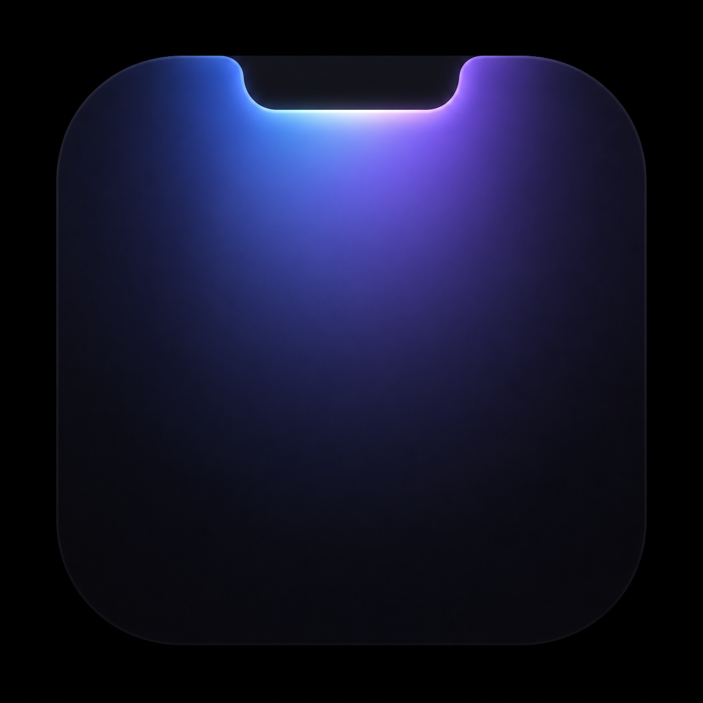

<p align="center">
  
</p>

# Sift

Sift is a small macOS app for quickly capturing random thoughts before they disappear, then using AI to distill them into clearer notes, notebook pages, and action items.

## Features

- **Fast capture from the notch or menu bar**: open Sift with the default `Option + Space` shortcut and jot down whatever is on your mind.
- **Categorisation with `<topic>:` prefixes**: write something like `work: follow up on launch notes` to hint where a thought belongs. Sift highlights the prefix while you type and strongly prefers a matching notebook page during processing.
- **Forced TODOs with `!` prefixes**: start a thought with `!`, for example `! follow up with Sam tomorrow at 3pm`, to force a todo while still letting the AI extract due dates and other structure.
- **Thought distillation**: AI turns raw thoughts into titles, summaries, tags, related thoughts, daily digests, and markdown notebook pages.
- **Todo creation**: concrete follow-ups become action items, with due-date inference and optional reminder notifications.
- **Raw and distilled library views**: search raw thoughts, browse distilled pages, render markdown, move or delete pages, and use AI-powered `Tidy` reorganisation.
- **Flexible AI providers**: use an OpenAI-compatible API, or Apple Foundation Models when available on a compatible Mac.

## How It Works

`Capture -> Store raw thought -> AI processing -> Pages/actions/digests -> Review in Library`

Sift keeps the raw thought intact, then derives structure around it. Processing can classify a thought as a notebook entry, a todo, or both; attach it to a page; generate markdown synthesis; and create actionable tasks when the thought contains a concrete next step.

## Prefix Examples

```text
product: tighten onboarding copy
life admin: renew passport next week
idea: tiny app for turning voice notes into briefs
```

## Setup

Open `Sift.xcodeproj` in Xcode and run the `Sift` scheme.

You can also build and install the app from the repo root:

```sh
./scripts/install-app.sh
```

For iterative development, use the reload script:

```sh
./scripts/dev-reload.sh
```

To rebuild and relaunch once without watching for changes:

```sh
./scripts/dev-reload.sh --once
```

The install scripts place the app at `~/Applications/Sift.app` by default and replace that app if it already exists.

Run the test suite from the repo root:

```sh
./scripts/test.sh
```

## AI Configuration

Open Sift from the menu bar, go to Settings, and enable AI processing.

For the OpenAI-compatible provider, configure the API base URL, API endpoint, model, and API key source. You can enter an API key directly, read it from the app process environment, or import a key from your login shell into Keychain. The default base URL is:

```text
https://api.openai.com/v1
```

You can also choose Apple Foundation Models on a compatible macOS 26 Apple Intelligence setup.

Environment variables from `.zshrc`, `.bashrc`, or other shell startup files are not visible to Sift when it is launched from Finder, Spotlight, or Login Items. Use **Import from shell** in Settings to run your configured login shell once, read the named variable such as `OPENAI_API_KEY`, and save the value through the normal Keychain-backed API key setting.

## Data & Privacy

- Raw thoughts are stored locally as JSON under `~/Library/Application Support/Sift/`.
- API keys are stored in Keychain, with a protected local fallback if Keychain storage is unavailable.
- Thoughts are sent to the configured AI provider only when AI processing is enabled.

## Requirements

- macOS target: 26.0
- Xcode with the macOS 26 SDK
- Swift package dependencies resolved by Xcode: `KeyboardShortcuts` and `swift-markdown`

## AI Disclosure

Sift was created entirely with Codex and GPT-5.5.
